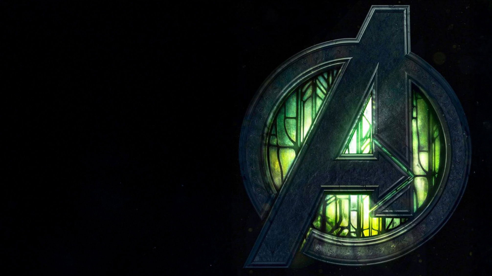

<div align="center">
  
</div>

<div align="center">

# Way to Doomsday

*A complete MCU watch-order tracker and countdown experience, built for the road to Avengers: Doomsday.*


</div>

<br/>

## Table of Contents

- [Overview](#overview)
- [Why This Exists](#why-this-exists)
- [How the Site Is Organized](#how-the-site-is-organized)
- [Features](#features)
- [Tech Stack](#tech-stack)
- [Project Structure](#project-structure)
- [Content & Attribution](#content--attribution)

<br/>

## Overview

Way to Doomsday is a fan-built companion site for tracking every Marvel Cinematic Universe release — every film and every series — in a single, continuous chronology leading up to *Avengers: Doomsday*. It pairs a live countdown to the film's theatrical release with an interactive timeline, a phase-by-phase breakdown, and a character-focused spotlight carousel, giving viewers one place to plan or revisit their watch order before the film premieres.

Rather than treating the MCU as a list of release dates, the site treats it as what it actually is: a single ongoing story spread across dozens of entries, several media formats, and more than fifteen years of production. The interface is built around that continuity — every title carries both its release year and its in-universe story year, so the viewing order and the narrative order can be understood side by side rather than as two separate references.

## Why This Exists

Keeping track of MCU watch order has traditionally meant piecing together wiki pages, fan forum threads, and outdated blog posts, most of which fall out of date the moment a new series or film is announced. Way to Doomsday consolidates that into a single, up-to-date reference: one timeline, one source of truth, built specifically around the countdown to *Avengers: Doomsday* rather than treating it as an afterthought once the credits roll.

The project was also built as an excuse to explore how a content-heavy, media-rich catalogue site can stay fast and responsive — background video, dozens of poster images, and a searchable dataset of every entry, without the site feeling heavy to load or navigate.

## How the Site Is Organized

- **Timeline** — every MCU film and series laid out in sequence, with the option to sort by release order or in-universe story order
- **Phases** — the catalogue grouped by its official Phase structure, for viewers who prefer to browse in production-era chunks rather than a single continuous list
- **Road to Doomsday** — a focused rail of the films and series that lead directly into *Avengers: Doomsday*, for viewers who only want to catch up on what's immediately relevant
- **Character Spotlight** — a rotating carousel introducing key figures across the franchise, each linking through to a dedicated character page with their full appearance history

## Features

- **Live countdown** to the *Avengers: Doomsday* theatrical release, updating in real time down to the second
- **Full MCU timeline** covering every film and series, sortable by story order or release order
- **Phase-by-phase breakdown**, from Phase 1 through the current slate, for structured browsing
- **Character spotlight carousel** highlighting key figures with quick access to their filmography
- **Grid and timeline views**, so the catalogue can be browsed in whichever layout suits the viewer
- **Search and filter** across titles, release years, and cast
- **Watch-order progress tracking**, stored locally in the browser with no account required
- **Dedicated character pages** with a per-character appearance history across the MCU

## Tech Stack

The site is built on [Astro](https://astro.build) for static-first performance, with interactive elements implemented as isolated islands in [React](https://react.dev) so that most of the page ships as static markup. Styling is handled entirely with [Tailwind CSS](https://tailwindcss.com), and the motion work — the countdown digits, the spotlight carousel, and modal transitions — is built with [Framer Motion](https://www.framer.com/motion/).

Preview video backgrounds are served from a [Cloudflare R2](https://developers.cloudflare.com/r2/) bucket rather than bundled into the repository. Keeping media assets in object storage rather than the codebase keeps the repository itself lightweight while still allowing larger video files to be served independently and reliably.

## Project Structure

```
waytodoomsday/
├── public/
│   ├── posters/          # Movie and series poster artwork
│   ├── banner/           # Hero and branding imagery
│   ├── bg/               # Background video clips
│   └── favicon assets     
├── src/
│   ├── components/       # Astro and React components (hero, timeline, cards, nav, footer)
│   ├── data/              
│   │   ├── movies.json   # The full MCU catalogue: titles, years, cast, story order
│   │   └── characters.js # Character metadata used by the spotlight and character pages
│   ├── hooks/             
│   │   └── useWatched.js # Local-storage-backed watch-progress tracking
│   ├── layouts/          # Shared page layout (head, fonts, footer)
│   ├── pages/             
│   │   ├── index.astro         # Home page — hero, timeline, phases, road to Doomsday
│   │   ├── privacy-policy.astro
│   │   └── character/[slug].astro  # Dynamic per-character detail pages
│   └── styles/           # Global stylesheet
└── astro.config.mjs
```

The `data/` directory is the single source of truth for the catalogue — every title on the timeline, in the phase breakdown, and on the Road to Doomsday rail is generated from `movies.json`, so the ordering logic lives in one place rather than being duplicated across components.

## Content & Attribution

Way to Doomsday is an unofficial, non-commercial fan project. It is not affiliated with, endorsed by, or connected to Marvel Studios or The Walt Disney Company. All movie titles, poster artwork, and character names remain the property of their respective copyright holders and are used here solely for identification and reference purposes.

<br/>

<div align="center">

---

**Built by Ayush**

[](https://ayushcmd.me)
[](https://github.com/ayushcmd)
[](https://linkedin.com/in/ayushcmd)

</div>